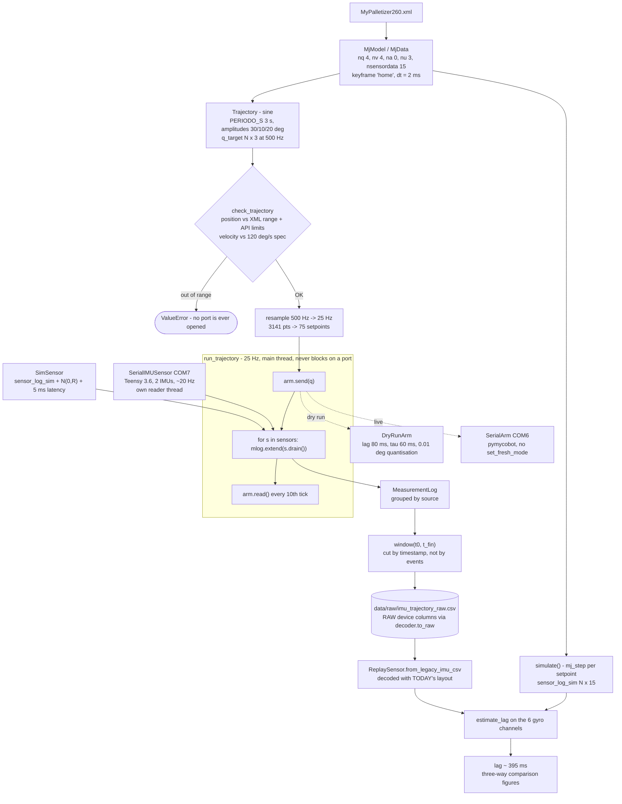
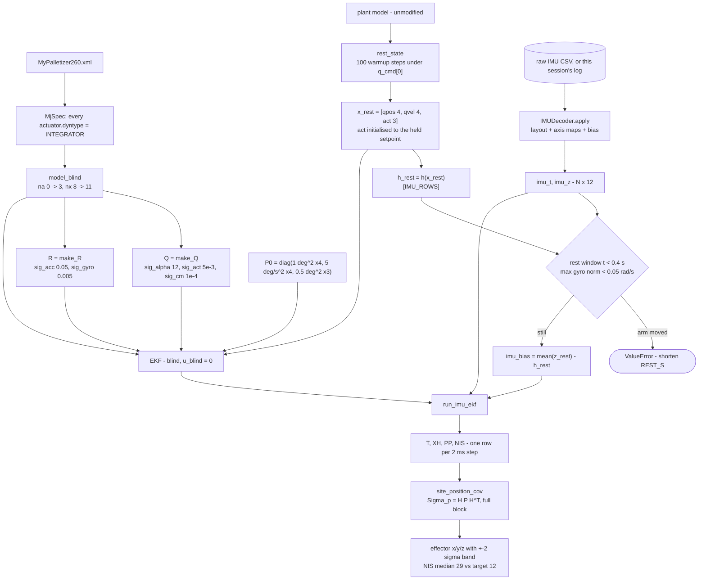
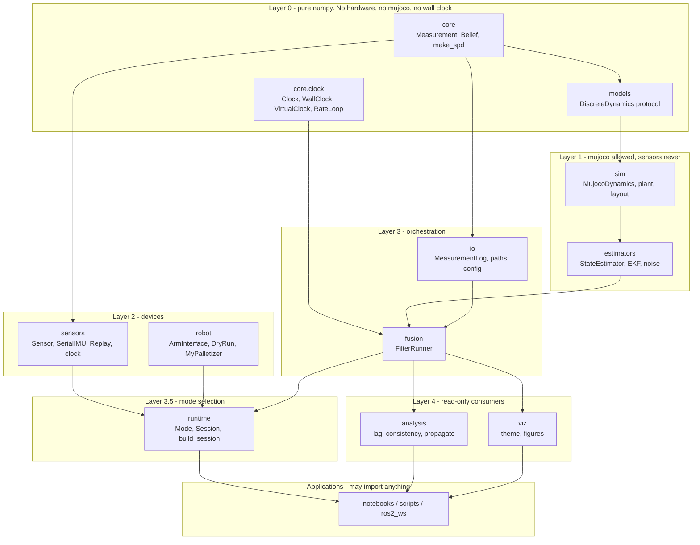
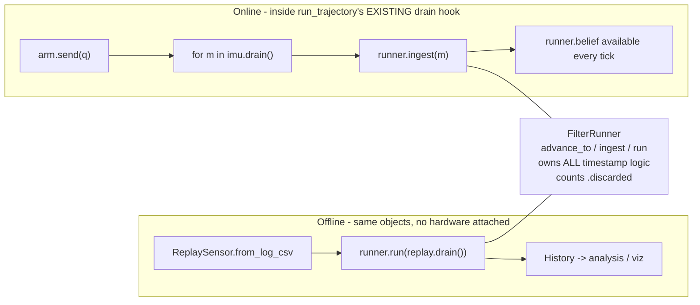
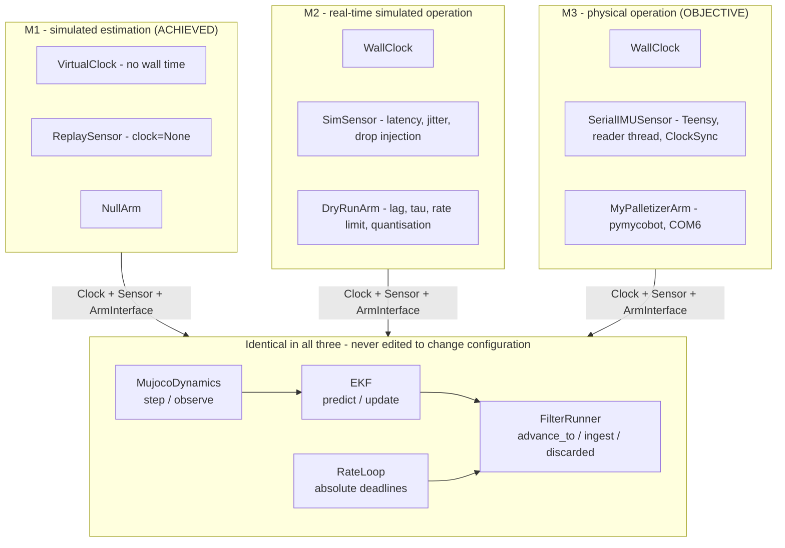
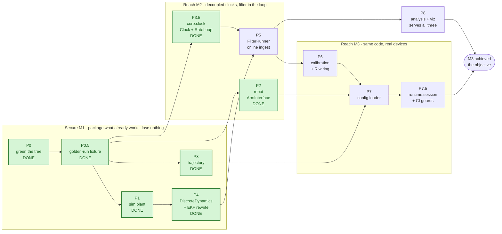

# ADR-0002 — From notebook to package: Phase 2 architecture

- **Status:** accepted, in progress
- **Date:** 2026-09-19 (progress updated 2026-09-20)
- **Supersedes:** ADR-0001 § D1 (the four ABCs) and § D5 (MuJoCo behind a sensor)
- **Subject:** `notebooks/mypalletizer260EKF.ipynb` → `software/src/erp/`

**Progress: P0, P0.5, P1, P2, P3, P3.5 and P4 are done. P5 onward are not
started.**

**Every phase in group G1 is now complete, and M1 is still not achieved.** The
two are not the same claim and it would be easy to bank the wrong one. M1's
acceptance criterion is that *the package*, not the notebook, reproduces the
golden run, plus a `ConsistencyReport` landing at NIS 11–13 on simulated data.
Today the golden run is still driven by `scripts/make_golden_run.py`, which
holds `run_imu_ekf` (P5's) and `site_position_cov` (P8's), and
`ConsistencyReport` does not exist. What G1 bought is that every *piece* it
uses now lives in the package. **M1 closes at P5 and P8, not here.**
The per-phase records are in § 5.2 and the obligation status is the rightmost
column of § 6. In short: the tree is green, M1's acceptance test exists as a
frozen fixture, `erp.sim.plant` + a fixed `erp.io.paths` have absorbed the
notebook's model-setup helpers, `erp.robot` owns both arms and the range guard
that gates every send, and `erp.trajectory` owns the setpoint profile — none
of it moving a digit of the golden run. The suite is **144 passed, 1 skipped
in ~1.3 s** (was 44/1 at P0), of which 100 are new in P0.5 through P3.

**P3 was reshaped before it was built, and § 5.2 records the disagreement
rather than quietly rewriting the plan.** The short version: its original
obligation guarded `qd`, which nothing downstream reads, while the real risk
was that the sine formula existed in five places including the golden-run
script. Read that entry before treating any other phase's stated test as
settled — the plan was written before the code was, and the same can be true
elsewhere.

M1's remaining phase is P4. The M2 phases that decide whether the filter can
run in the loop (P3.5, P5) have not started.

Nothing in § 2 or § 3 has been rewritten to match. Those sections record the
pipeline and its blockers **as found**, and the measured numbers in them are
the reason they are worth keeping; where a phase has since resolved a blocker,
the item carries a *Resolved* note pointing at the phase rather than
disappearing.

ADR-0001 is the record of the *finger* design and most of its code no longer
exists. This ADR records the state of the working palletizer notebook, what
blocks it from becoming a package, and the order in which to move it.

---

## 1. Context

The project's target is now the **Elephant Robotics MyPalletizer260**: an EKF
over MuJoCo dynamics, fed by two IMUs streamed from a Teensy 3.6 over USB
serial. `notebooks/mypalletizer260EKF.ipynb` runs that end to end today —
trajectory generation, the real arm, a MuJoCo replay of the same setpoints, an
IMU log, the filter, and end-effector covariance propagation.

The notebook is the application and the source of truth. The `erp` package is
what has been extracted from it so far: `sensors/`, `io/`, `core/`, `sim/`
and a blind `EKF`. Roughly half the pipeline is still cell-scoped.

The goal of Phase 2 is not new capability. It is to move the remaining half
into the package **without changing a single number the notebook prints**, so
that the same code can later run online, against a different arm, or under
ROS 2.

### 1.1 Three capability milestones

The project advances through three milestones. They are **capabilities the
framework has**, not objectives it is aimed at and not alternative products:
each is achieved once and then stays available, because the earlier ones are
what keep the later one honest. Reaching M3 is the objective; M1 and M2 are
the capabilities the framework must hold on the way there.

**M1 is already achieved**, in `notebooks/mypalletizer260EKF.ipynb`. Parts of
M2 and M3 are too. The table below is a status report, not a plan:

| | **M1 — simulated estimation** | **M2 — real-time simulated operation** | **M3 — physical operation** |
|---|---|---|---|
| Capability | the filter is consistent against MuJoCo-generated data with known truth | commands and measurements run on independent clocks and the filter consumes them **online** | the same code drives the real arm and real IMUs |
| Hardware | none | none | arm + Teensy |
| Status | **achieved** (notebook) | **partial** | **partial** |
| What exists | plant sim -> `sensor_log_sim` -> `SimSensor` + noise -> blind EKF -> effector position with covariance | `DryRunArm` at 25 Hz and `SimSensor` at 20 Hz with 5 ms latency, drained per tick into `MeasurementLog` | real arm driven, real IMU log captured, EKF run on it offline; 395 ms transport lag characterised |
| What is missing | nothing functional — it lives in cells, not in the package | **the filter is still post-hoc**, not in the loop; no single clock authority; no fault injection | **online operation**; device-clock sync; a calibrated `R` |
| Evidence | `sig_act` sweep at 5e-3: NIS 11–13 (target 12), effector NEES 1.8–2.2 (target 3), 2σ coverage 1.00 / 1.00 / 0.93–0.96 | achieved rate and jitter reported per run; `received` / `rejected` / `overruns` counted | NIS median 29 on real data (target 12), effector σ propagated, `lag_imu` ≈ 395 ms |

Read that middle row carefully, because it is the whole shape of the work:
**M1's risk is regression, not construction.** The capability exists and is
measured; moving it into the package can only lose it. That is what P0.5 (the
golden-run fixture, § 5.2) is for — it turns M1 from "it worked that day in
that kernel" into something CI can defend.

M2 and M3 are each missing one structural thing and a few honest details. For
both, the structural thing is the same: **estimation is offline.** The
notebook already acquires at decoupled rates, against a dry-run arm and
against the real one; what it does not do is run the filter inside that loop.
`run_trajectory`'s per-tick `drain()` is the documented hook where it will go.

Once achieved, a milestone does not retire. M1 becomes the regression suite,
M2 becomes the place where scheduling faults are injected before they are met
on hardware, and both remain selectable at runtime through the `Mode` enum of
§ 4.8. The architecture therefore has to keep all three paths alive, not
migrate through them.

The seams already exist in embryo: `ReplaySensor` takes a
`clock: Callable[[], float] | None` where `None` releases everything (M1) and
`time.perf_counter` releases on schedule (M2), and `SerialIMUSensor` is M3.
What is missing is a single clock authority, a rate scheduler, an online
runner, and one place where the choice is made.

---

## 2. The pipeline today

### 2.1 Acquisition workflow — trajectory to logged measurements



Two properties of this half are already correct and must survive the refactor:

- **The guard runs before anything opens a port.** A trajectory out of position
  *or* velocity range raises before an arm object exists.
- **The log is cut by timestamp, not by thread events**, and is written with
  **raw device columns**. Fixing the wiring, the axis maps or the bias
  therefore also fixes every old log.

### 2.2 Estimation workflow — logged measurements to end-effector covariance



### 2.3 Rates and clocks

Every rate in the system is independent. Nothing ticks together.

```
 500 Hz   trajectory definition          q_target / qd_target       (offline array)
 500 Hz   MuJoCo physics = EKF predict   dt = 2 ms
  25 Hz   setpoint stream to the arm     run_trajectory tick        <- also drains sensors
  20 Hz   IMU lines from the Teensy      50 +- 1 ms, firmware-bound
 2.5 Hz   arm position readback          every 10th tick

         ~395 ms   arm transport lag     firmware setpoint queue, no set_fresh_mode
         ~  5 ms   IMU transport latency assumed; unmeasured, no device timestamp yet
```

Inside the filter, the ratio that matters is **~25 predicts per update**:

```
 t ->      0 ms        50 ms       100 ms      150 ms
           |           |           |           |
 IMU       M           M           M           M          20 Hz, 12 channels each
           |           |           |           |
 predict   |...........|...........|...........|          2 ms steps, ~25 per gap
           U           U           U           U          one 12-channel update, ~360 us
```

One 12-channel update costs ~360 us; four separate 3-channel updates cost
~1.4 ms. That is why one serial line becomes exactly one `Measurement`.

### 2.4 State and observation layout

```
x  (nx = 11, blind model)

  +---------------------+---------------------+-------------------+
  |     qpos[0..3]      |     qvel[0..3]      |     act[0..2]     |
  |  rot link1 link2 act|  rot link1 link2 act|  rot link1 link2  |
  |        rad          |       rad/s         |       rad         |
  +---------------------+---------------------+-------------------+
                     ^                                  ^
     qpos[3] = passive parallelogram,     servo setpoints the filter recovers
     tendon-driven, never commanded       in place of the u it never receives


sensordata  (15 channels)

  rows  0.. 2   link1_acc     m/s^2   site frame    measured   <- IMU_0
  rows  3.. 5   link2_acc     m/s^2   site frame    measured   <- IMU_1
  rows  6.. 8   link1_gyro    rad/s   site frame    measured   <- IMU_0
  rows  9..11   link2_gyro    rad/s   site frame    measured   <- IMU_1
  rows 12..14   efector_pos   m       world frame   NOT measured -- output only
```

`efector_pos` is never fed to the filter. It is read out of `h(x)` afterwards
so that `Sigma_p = H P H^T` gives the end-effector covariance for free, from
the same finite-difference Jacobian the filter already uses.

The plant model has `na = 0`, so `nx = 8`. `compile_blind_model` flips every
actuator to `dyntype="integrator"` through `MjSpec` — not by editing the XML
text, because the file has an `<include>` and relative mesh paths that
`from_xml_string` cannot resolve. Without that step, `ctrl = 0` makes every
servo pull toward zero and the filter "knows" the arm is returning home.

### 2.5 Stage inventory

| # | Stage | Owner today | Output |
|---|---|---|---|
| 0 | Model load | notebook `find_repo_root` | `model`, `data`, `dt` |
| 1 | Trajectory | notebook cell | `t`, `q_target`, `qd_target` |
| 2 | Range guard | notebook `check_trajectory` | `api_deg` or `ValueError` |
| 3 | Plant sim | notebook cell | `sensor_log_sim` (N,15), video |
| 4 | Arm transport | notebook `DryRunArm` / `SerialArm` | `send` / `read` / `close` |
| 5 | Streaming loop | notebook `run_trajectory` | log dict, achieved rate, jitter, `t0` |
| 6 | Sensor config | notebook cell + `erp.sensors` | `IMUDecoder`, `IMU_ROWS`, `IMU_R` |
| 7 | Persistence | `erp.io.MeasurementLog` | raw CSV |
| 8 | Alignment | notebook `estimate_lag`, `plot_three_way` | lag, figures |
| 9 | Filter setup | notebook `compile_blind_model`, `rest_state` | `model_blind`, `x_rest`, `Q`, `P0`, bias |
| 10 | Filter run | notebook `run_imu_ekf` + `erp.estimators.EKF` | `T`, `XH`, `PP`, `NIS` |
| 11 | Output | notebook `site_position_cov` | `p_ef`, `C_ef`, coverage |

Only stages 6, 7 and the inner EKF algebra of stage 10 live in the package.

> The table above is the **as-found** inventory and is left that way so the
> starting point stays legible. Delta since:
>
> - **P1** moved stage 0 (`find_repo_root` → `erp.io.paths`, plus
>   `load_model`) and the model-setup half of stage 9 (`compile_blind_model` →
>   `blind_variant`, `rest_state` → `warmup_to_rest`) into `erp.sim.plant`.
> - **P2** moved stage 2 (`check_trajectory` → `JointMap.validate`) and stage 4
>   (`DryRunArm`, `SerialArm` → `MyPalletizerArm`) into `erp.robot`.
> - **P3** moved stage 1 (the sine formula and `resample`) into
>   `erp.trajectory`. Its *knobs* — `PERIODO_S`, `AMPLITUDES_DEG` — did not
>   move; they are configuration and belong to P7.
>
> Stage 9's `Q`, `P0` and bias remain cell-scoped; stages 8, 10 and 11 sit in
> `scripts/make_golden_run.py` awaiting P5 and P8; stages 3 and 5 have not
> moved. So the sentence now reads: stages 0, 1, 2, 4, 6, 7, the model-setup
> half of 9, and the inner EKF algebra of 10.

---

## 3. What blocks the transition

Ordered by how much damage each one does, not by effort.

### 3.1 Both hardware switches are committed as `True`

`SEND_TO_ROBOT = True` and `RUN_ROBOT_WITH_IMU = True`. "Run All" opens COM6
and COM7 and moves the physical arm, while the comment banner above each cell
says the opposite ("ROBOT REAL. APAGADO."). Default off, and make the flag the
only thing that can construct a `SerialArm`.

### 3.2 The sensor's `R` never reaches the filter

`Measurement` carries `rows` **and** `R`, and `SerialIMUSensor.apply_calibration`
swaps in a calibrated `R`. But `EKF.update(z, rows)` takes no `R` and uses
`self.R[np.ix_(rows, rows)]`, and `run_imu_ekf` unpacks measurements into bare
arrays before the filter ever sees them.

**Calibrating a sensor today changes nothing about the filter.** The
`Measurement` abstraction dead-ends at `MeasurementLog`.

> **Half resolved in P4.** `EKF.update(z, rows, R=None)` now accepts a
> per-measurement `R` and uses it when given. The dead end is closed on the
> filter's side; the other half — `run_imu_ekf` still unpacking measurements
> into bare arrays before the filter sees them — is P5's, and until that
> happens nothing actually passes the `R` through. Note this changed no
> number: the sensor's `R` is built as the very block the filter was already
> slicing out (`make_golden_run.py:237`), so the two paths agree today and
> only diverge once `calibrate()` runs on the arm at P6.

### 3.3 Three copies of the IMU wiring, two of which disagree

| Source | link1 | link2 |
|---|---|---|
| notebook `IMU_LAYOUT` | IMU_0 | IMU_1 |
| `config/estimation.yaml` | IMU_0 | IMU_1 |
| `software/tests/conftest.py` | **IMU_1** | **IMU_0** |

The config carries the fitted residuals (gyro rms 0.06–0.10 rad/s against 0.34
for the swapped assignment), so the config is right. No loader reads the YAML,
so it is documentation that cannot drift-check itself.

### 3.4 `run_imu_ekf` is an ad-hoc scheduler

Fixed 2 ms predicts, `int(round(tk / dt))` for placement, a `k_now` cursor that
never rewinds, no late-measurement branch, no counter. It assumes one sorted,
on-time stream. A second sensor with a different latency breaks it silently —
which is exactly the failure mode ADR-0001 § D6 was written about.

### 3.5 Global mutable configuration

`SIGNS`, `OFFSETS_DEG`, `API_LIMITS_DEG`, `J4_HOLD_DEG`, `VMAX_DEG_S` are
module-level, and the negative-test cell mutates `SIGNS[:]` in place under
`try/finally`.

> **Resolved in P2.** All five are now fields of one frozen `JointMap`, whose
> arrays are additionally flagged read-only — freezing the dataclass alone
> would not have stopped `SIGNS[:] = ...`. The negative-test cell builds a
> second map with `dataclasses.replace` instead of mutating a global, and the
> `try/finally` that restored it is gone with it, because there is no longer
> anything to restore. `STREAM_RATE_HZ` and `STREAM_SPEED` are still cell
> globals; they are loop configuration and belong to P5.

### 3.6 Cross-cell implicit state

`globals().get("imu_t")`, `globals().get("mlog_traj")`, `globals().get("lag_imu")`,
plus `link1_acc_history` … `efector_pos_history` produced by the simulation
cell. Cell order is an undeclared dependency.

Worse, that post-processing hardcodes `sensor_log_sim[:, 0:3]`, `[:, 3:6]`,
… `[:, 12:15]` — the exact failure `sensor_layout` in `viewer.ipynb` exists to
prevent. Add a sensor above the others in the XML and every index still returns
numbers, just from the wrong channel.

> **Resolved in P1** — the hardcoded slices only. The post-processing now calls
> `erp.sim.plant.sensor_layout(model)`. The `globals().get(...)` cell coupling
> above it is untouched and is P5/P7.5 work.

### 3.7 Duplicated and mislocated helpers

- `find_repo_root` is written three times, in three notebooks.
  → **Resolved in P1**: one `erp.io.paths.repo_root`, which searches upward for
  `pyproject.toml` starting from the *module* rather than probing `Path.cwd()`,
  so the answer no longer depends on where the kernel was launched. The old
  version also matched a directory *named* `preERP`, so renaming the clone
  broke it.
- `erp.io.paths.resolve_model_path` hardcodes `notebooks/<subfolder>/`, so it
  cannot find the palletizer XML under `mechanical/` at all.
  → **Resolved in P1**, by adding `resolve_repo_path` rather than changing
  `resolve_model_path`'s meaning — see the P1 record in 5.2 for why it was kept.
- Warmup-to-equilibrium is written three times (the sim cell, `simulate`,
  `rest_state`).
  → **One of three resolved in P1**: `rest_state` → `warmup_to_rest`.
  `simulate` in the trajectory cell still carries its own `warmup_steps=100`
  loop; it belongs to the acquisition path and moves with P3/P5.
- **Not in the original inventory, found during P3:** the sine formula
  `sin(w*t - pi/2)*A + A` was written out five times — notebook cells 3 and 13
  (three occurrences), `test_robot.py` and `scripts/make_golden_run.py`. Worth
  noting *when* those appeared: two of the five were created **by this
  migration**, in P0.5 and P2, not found in the notebook. A phase that lifts
  code into a script or a test can add a copy while removing one, and § 3 is
  an inventory of the starting point, not a standing count.
  → **Resolved in P3**, down to one. The `make_golden_run.py` copy is the one
  that mattered; see 5.2's P3 entry.
- `check_trajectory` reads `model.jnt_range[k]` positionally for `k` in 0..2,
  assuming joint order matches `JOINT_NAMES`. True today, unchecked.
  → **Resolved in P2**: `JointMap.validate` looks each range up by joint name.
  The assumption really was true — the XML declares `rot`, `link1`, `link2`,
  `act` in exactly that order — so this changed no verdict on any trajectory
  the notebook runs. What it buys is that the falsification now *has* a
  failure to point at: on a reordered map, positional lookup waves through a
  trajectory that is 50 deg outside `link2`'s range without a word.

### 3.8 Prototype logic worth keeping, in the wrong place

`DryRunArm` (first-order lag + rate limit + 0.01 deg quantisation — a genuinely
good falsification harness), `estimate_lag`, `site_position_cov`, the plot theme
`_style`/`_header`, `sensor_report`, and the negative-check cell whose three
rejected trajectories are already written as tests in everything but name.

> **`DryRunArm` moved in P2**, into `erp.robot.dry_run`, and the negative-check
> cell's three trajectories are now `pytest.raises` cases in `test_robot.py`
> — "already written as tests in everything but name" turned out to be exact.
>
> **Partly relocated by P0.5** — `estimate_lag`, `run_imu_ekf` and
> `site_position_cov` now live in `scripts/make_golden_run.py`, which is a
> holding pen, not a home: they are still outside the package and still claimed
> by P5 and P8. `_style`/`_header` and `sensor_report` are untouched (P8).
>
> One thing to carry into P8: `site_position_cov` returns the **full** 3×3
> `C_ef`, and the fixture keeps only `sig_ef = sqrt(diag(C))`. Measured over
> the golden run, the 1σ ellipsoid's major axis sits a median **24.9°** (max
> 45.0°) off the nearest world axis, so the per-axis sigmas understate the
> worst direction by a median 9.6% and up to **39.7%**. 2.2 draws that node as
> "`Sigma_p = H P H^T`, full block" and 2.5 lists `C_ef` as stage 11's output,
> so the fixture is the one place the full block is dropped.
> `propagate_to_site` should keep `C`; adding the key leaves every existing
> array bit-identical, so the `rtol=1e-12` check still holds.

### 3.9 Leftovers

A stray `import pandas; pd.read_csv("../data/raw/...")` cell with a relative
path and no consumer. Ports `COM6` / `COM7` inline. Four MuJoCo loads per
filter step where two would do (`F_dyn` then `f_dyn`, `H_dyn` then `h_dyn`),
which `estimators/ekf.py` already flags in a comment.

---

## 4. Target architecture

### 4.1 Package map

The top level (`software/src/`, `config/`, `software/tests/`, `docs/`) is
already right. The work is inside the package. New packages marked **NEW**:

```
software/src/erp/
├── core/
│   ├── types.py          Measurement, CalibrationResult, + Belief, UpdateInfo
│   ├── clock.py      NEW Clock protocol, WallClock, VirtualClock, RateLoop
│   └── linalg.py         make_spd, nees, nis
├── models/
│   ├── base.py       NEW DiscreteDynamics protocol  (singular, see 4.4)
│   └── linear.py        + LinearDynamics -- the no-mujoco case for the P4 test
├── sim/
│   ├── mujoco.py         f/F/h/H, make_Q             (exists, needs cleanup)
│   ├── plant.py      NEW load_model, blind_variant, warmup_to_rest, sensor_layout
│   └── dynamics.py   NEW MujocoDynamics -- the DiscreteDynamics implementation
├── estimators/
│   ├── base.py       NOT BUILT -- one estimator, see 5.2's P4 entry
│   ├── ekf.py            EKF, no longer holding an MjModel
│   └── noise.py      NEW Q / R builders, moved out of sim/
├── sensors/              unchanged: base, stream, imu_serial, replay, sim, clock, mujoco
├── robot/            NEW ArmInterface, DryRunArm, MyPalletizerArm, JointMap
├── trajectory.py     NEW sine_sweep, resample   (a module: `validate`
│                         went onto JointMap in P2, see 5.2's P3 entry)
├── fusion/           NEW FilterRunner -- the only place time logic lives
├── runtime/          NEW Mode, Session, build_session -- the ONLY module that
│                         names a concrete driver class (see 4.8)
├── calibration/      NEW rest_bias, extending calibration_from_samples
├── analysis/         NEW estimate_lag, ConsistencyReport, propagate_to_site
├── viz/              NEW theme, three_way, sensor_compare, effector_band
└── io/
    ├── log.py            MeasurementLog
    ├── paths.py          fixed: repo-root relative, not notebooks/-relative
    └── config.py     NEW YAML loader -> typed dataclasses
```

### 4.2 Import direction



`robot/`'s only consumer inside `erp` is `runtime/`, which constructs it: an arm
is a **command sink**, not a measurement source, and nothing in the estimation
stack — `core`, `models`, `sim`, `estimators`, `fusion` — may reach it. It sits
beside `sensors/`, not under it.

`fusion/` likewise does not import `sensors/`. `FilterRunner.ingest` takes a
`Measurement`, which is a `core` type, so the filter never learns which class
produced it. That is what makes the same runner work in all three.

`viz/` is allowed to import matplotlib, gated behind the `[viz]` extra. The
current "geometry only, no backend" rule produced an empty package while the
real plotting code accumulated in notebook cells.

The CI import-direction grep should be widened to match: it currently scans
only `estimators/` and `models/` for absolute `erp.sensors` imports, which
catches neither relative imports nor `sim/`, `core/`, `io/`.

### 4.3 Target workflow — one runner, two entry points



The hook already exists and is already documented as the EKF attachment point
in `run_trajectory`'s docstring. Nothing about the loop has to be restructured.

Two entry points, three milestones: **M1 is the offline path**, and M2 and M3
are both the online one, differing only in which `Sensor` and `ArmInterface`
are plugged in and which `Clock` paces the loop. Today only the offline path
exists — building the online one is what turns M2 and M3 from partial into
achieved. § 4.6 and § 4.7 make that precise.

### 4.4 Core interfaces

**The decoupling that matters most: the EKF must not hold an `MjModel`.**

```python
# erp/models/base.py
class DiscreteDynamics(Protocol):
    """One fixed-step transition and one observation.

    Knows nothing about sensors, wall-clock time, or where z came from.
    """
    nx: int          # state dimension
    nz: int          # full observation dimension
    nu: int
    dt: float        # native step, seconds

    def step(self, x: Array, u: Array) -> tuple[Array, Array]:
        """(x_next, F) -- x_{k+1} and df/dx, both at (x, u)."""

    def observe(self, x: Array, u: Array) -> tuple[Array, Array]:
        """(z, H) -- full predicted observation and dh/dx, both at (x, u)."""
```

Paired returns rather than four separate `f` / `F` / `h` / `H` methods, for two
reasons: it halves the MuJoCo loads per filter step (four to two), and it
guarantees the value and its Jacobian come from the *same* linearisation point.

> **Corrected after building it (P4):** only the second reason survives
> measurement. The load count does halve, but loads are not the cost —
> `mjd_transitionFD` runs `nx+1` internal evaluations and dominates. Measured
> per predict+update cycle: 143.5 µs → 131.5 µs, about 8%, not the 50% the
> count implies. The same-linearisation-point guarantee is reason enough on
> its own, and is what the docstrings now give.
`f/F/h/H` stay in `sim/mujoco.py` as thin wrappers for the notebooks that
already call them.

This is also why ADR-0001's split between `ProcessModel` and `MeasurementModel`
is not revived: MuJoCo computes both from one `MjData` load, so splitting them
doubles the cost and invites two linearisation points.

```python
# erp/core/types.py  (additions)
@dataclass(frozen=True, slots=True, eq=False)
class Belief:
    x: Array      # (nx,)
    P: Array      # (nx, nx)
    t: float      # host seconds, absolute perf_counter base

@dataclass(frozen=True, slots=True, eq=False)
class UpdateInfo:
    innovation: Array   # (k,)
    nis: float
    rows: IntArray
    t: float
```

```python
# erp/estimators/base.py
class StateEstimator(ABC):
    dyn: DiscreteDynamics

    @property
    @abstractmethod
    def belief(self) -> Belief: ...

    @abstractmethod
    def predict(self, n_steps: int = 1) -> None:
        """Advance n_steps * dyn.dt. No u parameter: blind by construction."""

    @abstractmethod
    def update(self, z: Array, rows: IntArray, R: Array | None = None) -> UpdateInfo:
        """z is the FULL observation vector; rows selects measured channels.

        R overrides the default noise block -- pass Measurement.R here. This is
        the parameter whose absence makes calibration a no-op today (3.2).
        """
```

`EKF.__init__(dyn, x0, P0, Q, R_default, *, t0=0.0)`.

**Why this makes the EKF hardware-agnostic, concretely:** the signature lets
you construct an EKF over a 1-D constant-velocity `DiscreteDynamics` with a
closed-form Kalman solution and assert the two agree to machine precision —
with MuJoCo not installed. That is the first estimator test this suite can
have, and it is the proof that the abstraction holds rather than an assertion
that it does.

```python
# erp/fusion/runner.py
class FilterRunner:
    """The only object in erp that converts a timestamp into filter steps."""

    def __init__(self, est: StateEstimator, *, t0: float,
                 buffer_horizon: float = 0.0) -> None: ...

    def advance_to(self, t: float) -> int:
        """Integer predict steps up to t. Returns the number taken."""

    def ingest(self, m: Measurement) -> UpdateInfo | None:
        """Advance to m.timestamp, then update with m.z / m.rows / m.R.

        A measurement older than the filter time is DROPPED and counted in
        .discarded -- a silent discard path is how a sensor quietly stops
        contributing while every plot still looks correct.
        """

    def run(self, ms: Iterable[Measurement]) -> History: ...

    discarded: int
```

```python
# erp/robot/base.py
class ArmInterface(ABC):
    """A command sink. DryRunArm and SerialArm are already duck-compatible."""
    name: str
    def send(self, q_rad: Array, speed: int | None = None) -> None: ...
    def read(self) -> Array | None: ...      # (4,) API degrees, None on no reply
    def close(self) -> None: ...
    def __enter__(self) -> ArmInterface: ...
    def __exit__(self, *exc: object) -> None: ...


@dataclass(frozen=True)
class JointMap:
    """Model joints <-> API joints. Replaces the SIGNS / OFFSETS globals (3.5)."""
    names: tuple[str, ...]
    api_ids: tuple[int, ...]
    signs: Array
    offsets_deg: Array
    api_limits_deg: Mapping[int, tuple[float, float]]
    vmax_deg_s: float = 120.0

    def to_api_deg(self, q_rad: Array) -> Array: ...
    def to_model_rad(self, deg: Array) -> Array: ...
    def validate(self, q_rad: Array, model: MjModel,
                 t: Array | None = None) -> Array: ...   # was check_trajectory
```

Frozen, so the `SIGNS[:] = ...` mutation becomes impossible; the negative tests
construct a different `JointMap` instead. `validate` looks joint ranges up by
name (`model.joint(name).range`), not by position (3.7).

### 4.5 Abstractions deliberately excluded

Keeping high-level abstraction light is a requirement, so, explicitly **not**
proposed: a plugin or registry layer; a dependency-injection container; a
`KalmanFilter` class separate from `EKF` (handed a linear `DiscreteDynamics`
the EKF reduces to it exactly); a split between process and measurement models
(see 4.4); `asyncio` anywhere (see 4.7); and any ROS 2 layer until the online
path through `FilterRunner` actually runs.

### 4.6 Three milestones, one code path

The milestones are capabilities, but at runtime they are *configurations* —
which concrete `Clock`, `Sensor` and `ArmInterface` get constructed. Because
none of them retires, all three stay selectable for the life of the project:



Three abstractions carry the whole difference: `Clock`, `Sensor` (exists) and
`ArmInterface` (phase P2). Nothing else in the package may branch on which
configuration is running.

M1's `VirtualClock` is an implementation convenience, not what defines the
milestone: it is what lets a 3 s trajectory be regression-tested in
milliseconds and removes OS sleep granularity from scheduling tests. M1 is
"the filter is consistent on simulated data", and it would still be M1 if it
ran on a wall clock — just slower and noisier to test.

### 4.7 Clock and rate management

#### The invariant

> The command period is a **scheduling parameter**. The sensor period is a
> **property of the device**. Neither is derived from the other, and no code
> may assume an integer ratio between them.

Three rates run today, deliberately unrelated:

```
               0   50  100  150  200  250 ms        1 char = 10 ms
               |    |    |    |    |    |
 cmd   25 Hz   C...C...C...C...C...C...C            40 ms period, a scheduling choice
 imu   20 Hz   M....M....M....M....M....            50 ms period, set by firmware
 ekf  500 Hz   |||||||||||||||||||||||||             2 ms step, set by the XML
 update        U....U....U....U....U....            one per IMU line, NEVER per command
```

The command and IMU ticks coincide only every 200 ms. A design that quietly
assumes "one measurement per control tick" — the most common way to write this
loop — would drop one IMU sample in five here, and would break differently at
every rate the user picks. This is the property M2 exists to test.

#### The `Clock` seam

```python
# erp/core/clock.py -- pure, Layer 0, the ONLY module allowed to read a wall clock
class Clock(Protocol):
    def now(self) -> float:
        """Seconds, monotonic, arbitrary origin. The one host time base."""

    def sleep_until(self, t: float) -> None:
        """Block (or, virtually, jump) until now() >= t."""


class WallClock:
    """time.perf_counter + time.sleep. M2 and M3."""


class VirtualClock:
    """A counter. sleep_until jumps instantly. M1.

    Makes a 3 s trajectory a millisecond-long test, and makes scheduling
    deterministic -- no OS sleep granularity, no jitter, so a scheduling test
    that fails here has failed on logic, not on load.
    """
```

**Constraint, stated because it is not free:** `VirtualClock` cannot drive a
live threaded sensor — a reader thread runs on real time and will not jump.
M1 is therefore restricted to replay sources. Attempting M1 with a
`StreamSensor` must raise at session construction, not deadlock at runtime.

#### The rate scheduler

```python
class RateLoop:
    """Fixed-rate deadline scheduler over a Clock.

    Deadlines are ABSOLUTE (t0 + i / rate_hz), never cumulative sleeps: on
    Windows time.sleep granularity is 1-15 ms, and a cumulative loop banks
    that error every tick until the trajectory is visibly late. run_trajectory
    already does this correctly; this only lifts it out of the notebook.
    """
    def __init__(self, clock: Clock, rate_hz: float, *, t0: float | None = None): ...
    def __iter__(self) -> Iterator[Tick]: ...      # Tick(i, t_target, t_actual, slip)

    achieved_hz: float
    jitter_ms: float
    worst_gap_s: float
    missed: int        # ticks whose deadline had already passed
```

Reporting achieved rate and jitter is not diagnostics decoration — at 100 Hz
the arm's `send` plus `get_angles` round trip does not fit in 10 ms, the loop
silently falls behind, and because `MyPalletizer260` has no `set_fresh_mode`
the surplus setpoints **queue in the firmware** and the lag accumulates for
the whole run. The counter is the only thing that makes that visible.

#### Concurrency model: threads, not async

One reader thread per live sensor; one main thread running `RateLoop`; no
`asyncio`. Reasons, in order of weight:

1. The blocking call is `serial.readline()`, which **releases the GIL**, so a
   blocked reader costs the command loop nothing. `StreamSensor` already
   documents and implements this.
2. `asyncio` would require async drivers for both `pyserial` and `pymycobot`.
   Neither has a good one on Windows, and the problem is two devices, not a
   thousand sockets — the shape `asyncio` is for.
3. A "ROS-like rate publisher" is what `RateLoop` is. When the ROS 2 wrapper
   arrives it drives these same objects from a timer callback; nothing in
   `erp` has to change, which is the point of keeping the loop ownable from
   outside.

```
M3  (and M2 with threaded=True)

  main thread                             reader thread  (one per live sensor)
  -----------                             ------------------------------------
  for tick in RateLoop(clock, 25):        transport.readline()   <- blocks, GIL released
      arm.send(q[tick.i])                 decoder.parse -> raw, t_dev
      for m in imu.drain():  ------+      clock.to_host(t_dev, t_arrival)
          runner.ingest(m)         |      buf.append(Measurement)
      runner.advance_to(now)       |            |
                                   +------------+
                          deque(maxlen=4096), the ONLY shared state.
                          Full -> evict oldest, count `overruns`.
                          Reader died -> next empty drain() raises SensorError.
```

The shared state is one bounded deque with counters. No locks in the hot path,
no queue the loop can block on, and both loss paths (`overruns`, `rejected`)
are counted rather than silent.

#### Asynchronous updates in the filter

`FilterRunner` is where the two rates meet, and the rules are:

1. **Advance to the measurement, not to the tick.** `ingest(m)` first calls
   `advance_to(m.timestamp)`, which issues `round((t - t_filter) / dyn.dt)`
   predicts, then applies the update. The filter's step count is a function of
   measurement timestamps only; the command rate never enters it.
2. **A measurement older than the filter time is dropped and counted** in
   `.discarded`. Silent discard is how a sensor stops contributing while every
   plot still looks correct.
3. **`buffer_horizon` trades latency for ordering.** Holding measurements `H`
   seconds before ingestion lets two sensors with different transport delays be
   sorted into timestamp order. The estimate then trails real time by `H`.
   `config/estimation.yaml` already reserves `buffer_horizon_s: 0.050`; with a
   single sensor the correct value is `0.0`, and it earns its keep the moment
   the arm's encoder readback becomes a second stream.
4. **Commands never touch the filter.** The EKF is blind by construction
   (`u_blind = 0`), so `arm.send` has no filter-side effect at all. If the
   filter ever becomes command-aware, the command enters as an `InputHistory`
   with its own actuation delay — *not* by reading the loop's setpoint
   variable. Sensor latency and actuation delay are different quantities in
   different layers.

### 4.8 The M2 → M3 guarantee

A drop-in claim is worth nothing asserted. Five mechanisms make it checkable.

**1. Two ABCs carry the difference.** `Sensor` (exists, already exercised by a
single parametrised contract suite over replay / sim / serial) and
`ArmInterface` (P2). M2 and M3 differ only in which concrete class is
instantiated.

**2. One construction point.** `erp/runtime/session.py` is the only module in
the package permitted to name `SimSensor`, `SerialIMUSensor`, `DryRunArm` or
`MyPalletizerArm`:

```python
class Mode(StrEnum):
    """Runtime configuration, not milestone. M1/M2/M3 are capabilities the
    project reaches once; these are the configurations that remain selectable
    afterwards, and all three stay supported for the life of the project."""
    BATCH = "batch"          # the configuration M1 runs in
    PACED = "paced"          # M2
    HARDWARE = "hardware"    # M3

@dataclass(frozen=True)
class Session:
    clock: Clock
    sensors: tuple[Sensor, ...]
    arm: ArmInterface
    runner: FilterRunner

def build_session(mode: Mode, cfg: EstimationConfig, **ports: str) -> Session: ...
```

Everything downstream takes `Session` and never sees the mode. Enforced the way
the import boundary already is, by a grep in CI:

```bash
grep -rlE "SerialIMUSensor|MyPalletizerArm|DryRunArm|SimSensor|ReplaySensor" \
     software/src/erp \
  | grep -vE "erp/(runtime/session|sensors/|robot/)"
# any output is a violation: a driver was named outside its own module
```

**3. No wall clock in the core.** The `Clock` is injected; no module below
`runtime/` may read time directly. Also grep-enforced:

```bash
grep -rnE "time\.(perf_counter|time|monotonic|sleep)" \
     software/src/erp/core software/src/erp/models software/src/erp/sim \
     software/src/erp/estimators software/src/erp/fusion \
  | grep -v "erp/core/clock.py"
# any output is a violation
```

This is the mechanism that makes M1 possible at all, and it is also what
guarantees M2 and M3 share a code path: if the runner could read the
clock itself, it would behave differently under pacing.

**4. Cross-mode parity is a test, not a hope.** M1 and M2 over the same
recorded log must produce the same filter output to tolerance. M2 adds
pacing and release timing; it must not add different mathematics. Divergence
means the timing layer has leaked into the estimator — exactly the bug this
architecture exists to prevent.

**5. M2 injects the M3 failure modes.** The point of paced simulation
is not that it works; it is that it can be made to fail the way hardware fails,
before hardware is attached. `SimSensor` must be able to inject: per-sample
latency **and jitter**, dropped samples, a drifting/wrapping device clock, and
a mid-run reader death. `DryRunArm` already models transport lag, first-order
servo response, rate limiting and 0.01 deg quantisation — point it at the
measured values (395 ms) rather than its defaults.

One detail worth copying from the deleted finger viewer, which learned it the
hard way: **injected latencies must be unequal between sensors to produce
reordering at all.** Equal latencies shift every timestamp by the same amount
and nothing arrives out of order, so a reordering test built on equal latencies
passes without testing anything.

#### What M2 cannot prove

Stating this is the difference between a useful staging mode and a false sense
of safety. M2 validates **interfaces, scheduling, ordering and loss
accounting**. It cannot validate the estimator against reality, because:

- **Timestamps are exact by construction.** `ClockSync`, the device-clock
  unwrap and the USB latency distribution only exist in M3. M2 with
  injected jitter approximates this; it does not reproduce it.
- **`R` is exactly correct.** M2 draws noise from the same `R` the filter
  is given, so the filter is told the exact noise it receives. `SimSensor`'s
  own docstring says this makes it "a plumbing check, not evidence about the
  estimator on real data". Real IMUs add bias, mounting tilt and scale error —
  in the 16/9 log, 3 to 8 sigma of constant offset per channel.
- **The plant is the model.** M2 runs the filter against MuJoCo output
  generated by MuJoCo. M3's arm has a 395 ms transport lag, firmware
  setpoint queueing, and servo gains that are not the XML's. The measured gap
  is already visible: NIS median 29 against a target of 12 on real data.

The correct expectation: **when M3 is switched on, nothing should need
editing, and the numbers should get worse.** If no code changes and NIS
degrades, the architecture worked. If code has to change, this ADR failed.

---

## 5. Migration roadmap

### 5.1 Phase order, grouped by the milestone each one serves



P8 sits outside the groups on purpose: the consistency report and the lag
estimator are how each milestone is *measured*, so they serve all three and can
land whenever they are needed.

### 5.2 Phases

Each phase is one commit, ends with all three checks green, and leaves the
notebook runnable. The tag on each says which milestone it serves.

**Milestone acceptance criteria** — what it means to call one done:

| | Achieved when |
|---|---|
| **M1** | the package, not the notebook, reproduces the golden run; `ConsistencyReport` on simulated data lands at NIS 11–13 against a target of 12 and effector NEES 1.8–2.2 against 3 |
| **M2** | one driver function runs command and measurement streams at a **non-integer rate ratio** with the filter ingesting online, reports achieved rate and jitter, counts every dropped and reordered sample, and survives injected faults — with no hardware attached |
| **M3** | that same driver function, unmodified, runs against `SerialIMUSensor` and `MyPalletizerArm`; the only differences from M2 are configuration values; `ClockSync` is on and `R` comes from `calibrate()` |

**P0 — Green the tree. DONE.** *(M1)* Fixed the 21 ruff and 9 mypy errors (all in
`sim/mujoco.py`, `sensors/mujoco.py`, `models/linear.py`,
`models/finger_config.py`, `io/paths.py`). Moved `mujoco` from the `[app]`
extra into `dependencies` — `erp.estimators` imports it at module scope, so CI
was type-checking a tree whose central dependency was absent. Dropped `scipy`,
unused since `models/discretize.py` was deleted; narrowed `[app]` to
`pyserial` + `pymycobot` (`pyqtgraph`/`PyQt5` served the deleted
`scripts/finger_viewer.py`). All four checks pass; `f`, `F`, `h`, `H`, `Q`,
`R`, `make_spd` and `linearize` were diffed against the pre-P0 tree and are
bit-identical.

The rule that came out of it, worth keeping: **`erp.sim.mujoco` is the only
module that touches the mujoco API**, and every function there wraps its
return in `np.asarray(..., dtype=np.float64)` or `int(...)`, so no `Any`
escapes the untyped boundary into the estimator under strict mypy.

**P0.5 — Freeze a golden run. DONE.** *(M1 — this is M1's acceptance test)* Before touching anything: run the notebook end
to end against `data/raw/imu_trajectory_raw.csv` and save `T_ekf`, `XH_ekf`,
`NIS_ekf`, `p_ef`, `sig_ef` to `data/processed/golden_ekf_run.npz`, plus the
scalars (`lag_imu`, NIS median, effector sigma). Add `test_golden_run.py`
asserting the pipeline reproduces them. Every later phase is then falsifiable
rather than hopeful, which is how the rest of this repo is tested.

*What landed:* `scripts/make_golden_run.py` carries the estimation half of the
notebook as a single `run_pipeline()` — no hardware, no cells, no globals — and
writes the fixture (203 KB, Git-LFS). `test_golden_run.py` (18 tests) imports
`run_pipeline` **from that script by path** rather than re-implementing it, so
the fixture and the test cannot drift apart. `--check` re-runs and diffs at
`rtol=1e-12`.

Two things worth recording beyond the obligation:

- The script was written to be **emptied**, not kept. Its docstring names each
  remaining function and the phase that claims it (`estimate_lag` → P8,
  `run_imu_ekf` → P5, `site_position_cov` → P8). P1 already removed three.
- `run_pipeline` takes `layout=` and `axis_maps=` for one reason: so the test
  can rebuild the run with the **swapped** IMU wiring of 3.3 and assert it does
  *not* reproduce the fixture. That is the falsification the "—" in § 6's row
  did not ask for, and it is what makes the fixture evidence rather than a
  recording of whatever happened to run that day.
- `test_filter_is_not_yet_consistent_on_real_data` pins NIS in `25 < x < 35`
  against a 12-DOF target of 12. The fixture freezes the pipeline's *output*,
  which is not the same as blessing it as correct, and a later reader should
  not be able to mistake one for the other.

CI also gained `lfs: true` on checkout. A bare `actions/checkout@v4` hands the
runner LFS **pointer files** for the STL meshes, so no mujoco test could ever
have passed there — this was latent before P0.5 and only surfaced once a test
needed the model assets.

**P1 — `erp.sim.plant`. DONE.** *(M1)* Move `find_repo_root` into a fixed `io/paths.py` that
resolves from the repo root; `compile_blind_model` → `blind_variant(path)`;
`rest_state` → `warmup_to_rest`; `sensor_layout` from `viewer.ipynb`. Delete the
three duplicate root-finders and replace the hardcoded `sensor_log_sim[:, 0:3]`
slicing with `rows_of`. *Test: `blind_variant` yields `na = 3`, `nx = 11`, and
the same `nsensordata` as the plant (the notebook's existing assert).*

*What landed:* `erp/sim/plant.py` (`load_model`, `blind_variant`,
`warmup_to_rest`, `sensor_layout`, `state_dim_of`) and a rewritten
`erp/io/paths.py` (`repo_root`, `resolve_repo_path`, `resolve_model_path`,
with `get_project_root` kept as an alias). All three notebooks were rewired —
**net −78 lines of duplicated code** — and `make_golden_run.py --check` still
reports `rtol=1e-12`, which is the point of doing P0.5 first. `test_plant.py`
(8) and `test_paths.py` (8) are new; the latter needs no mujoco and stays in
the fast loop.

Deviations from the plan above, both deliberate:

- The notebook's post-processing uses **`sensor_layout`**, not `rows_of`.
  `rows_of` returns concatenated indices for slicing `z`/`R`/`H` together;
  the post-processing wants one named block per sensor, which is a `slice`.
  `make_golden_run.py` uses `rows_of` where that is the right shape. Both read
  the model, which is the property 3.6 cares about.
- `resolve_model_path` was **kept**, not deleted, despite 3.7 calling it
  broken. Its one caller (`finger_imu_practice.ipynb`) genuinely wants
  `notebooks/assets/`; the bug was that it resolved that against `Path.cwd()`.
  It now resolves against the repo root and `resolve_repo_path` covers
  everything outside `notebooks/`.

The falsification is `test_skipping_the_warmup_misses_gravity_by_more_than_5g`,
and it is worth stating precisely because 2.4's claim is easy to overstate.
Measured on this model, `link2_acc_x` at rest:

| initial state | `link2_acc_x` |
|---|---|
| `warmup_to_rest` equilibrium | **9.810** m/s² |
| `home` keyframe, `act = 0`, no warmup | **4.144** m/s² |
| real IMU at rest | ~9.65 m/s² |

A 5.7 m/s² constant offset on a channel whose sigma is 0.05 is a 114-sigma
bias — no `Q` or `R` tuning repairs that. Note the counterfactual keeps
`qpos[3] = 1.5693`: zeroing the *whole* state instead gives 345 m/s², because
that breaks the tendon equality as well, which is a different and much louder
failure. Reporting the loud number would have made the test look stronger than
it is.

`erp.io.paths` also raises rather than guessing when it cannot find a repo
root (a non-editable `site-packages` install). Returning a plausible-but-wrong
root would send every asset lookup somewhere that exists and is empty.

**P2 — `erp.robot`. DONE.** *(M2, and the class M3 swaps in)* `ArmInterface`, `DryRunArm`, `MyPalletizerArm` (with a
real `close()` instead of reaching into `mc._serial_port`), `JointMap`. *Test:
the contract suite against `DryRunArm`; the notebook's three rejected
trajectories become three `pytest.raises` cases, and the "no `t` means velocity
is unchecked" control becomes the fourth.*

*What landed:* `erp/robot/` — `base` (`ArmInterface`, `JointMap`), `dry_run`,
`mypalletizer` — and `test_robot.py` (39 tests, only 7 of which need mujoco, so
the arm contract stays in the fast loop). The notebook lost **net 151 lines**;
both arm classes and the whole guard are now imported. The golden run still
reproduces at `rtol=1e-12`: P2 touched the command path, which the fixture's
estimation path does not run.

The contract suite is parametrised over **both** arms, the way
`test_sensor_contract.py` covers all three sensors, with a fake pymycobot
handle standing in for the real one. `pymycobot` is not installed in this
environment at all, which makes `test_importing_the_package_does_not_need_pymycobot`
a real check rather than a formality.

Four things came out of the move that the plan above did not anticipate:

- **`frozen=True` was not enough.** 4.4 says freezing makes the `SIGNS[:] = ...`
  mutation impossible. It does not: freezing blocks rebinding the attribute,
  not writing through the array it points at. The arrays are now flagged
  non-writeable, the same treatment `shared_rows_R` gives `rows`/`R`, and
  `api_limits_deg` is wrapped in a `MappingProxyType`. A test asserts all three
  writes raise.
- **Looking joint ranges up by name is inert today and still worth doing.** The
  XML happens to declare `rot`, `link1`, `link2`, `act` in that order, so
  `model.jnt_range[k]` was right — by luck, not by construction. The
  falsification uses a `JointMap` whose columns are in another order, which is
  a legitimate config: name lookup rejects a trajectory reaching -50 deg on the
  `link2` column, and the old positional lookup raises **no complaint at all**
  on the same data (it checks that column against `rot`'s ±159.9 deg, the API
  limit for J3 is ±92, and peak speed is 104.7 deg/s, under the 120 spec). The
  test asserts the positional variant stays silent, so it fails if it ever
  stops being a real falsification.
- **`close()` cannot be fully specified from here.** pymycobot is an optional
  dependency and is not installed, so which of `close` / `disconnect` /
  `_serial_port` `MyPalletizer260` actually exposes is unverified. The
  implementation prefers the public names and keeps the private attribute as a
  fallback — but a close that finds *no* way to release the port now raises
  instead of passing silently under `except Exception`. That last part is the
  real fix: the old version left the device held until the interpreter exited,
  and the next run failed at construction with a message about the port being
  busy, nowhere near the cause.
- **Both arms are context managers.** The notebook calls `arm.close()` as a
  plain statement after `run_trajectory`, so an exception mid-trajectory leaks
  the port. `__exit__` closes on the way out either way.

`DryRunArm` takes an injectable `clock`, matching `SimSensor`'s existing
parameter, because a first-order lag against `perf_counter` cannot be asserted
on. Note this is **not** an `erp.sensors.clock.HostClock` — that protocol
converts a device timestamp to host time and is a different job. The `Clock`
seam of 4.7 is still P3.5's to build; this is one `Callable[[], float]`, not
a preview of it.

Still in the notebook and still P3's: `resample`, and the trajectory generator
it resamples.

**P3 — `erp.trajectory`. DONE, reshaped.** *(M1)* ~~`SineSweep(amplitudes_deg,
period_s).sample(dt)` and `resample`. Test: peak velocity scales as
`A * 2 * pi / T` — the chain-rule bug the notebook comment warns about — and
`resample` preserves endpoints.~~

**Why the phase was reshaped, decided 2026-09-20 before it was built.** The
original spec is struck through rather than deleted because the disagreement
is the useful part. Three changes:

1. **A module, not a package.** 4.1 listed `trajectory/` as "SineSweep,
   resample, validate". P2 took `validate` onto `JointMap`, where it belongs —
   it needs a joint map and a model, not a trajectory. What was left is two
   functions, so `erp/trajectory.py` is a module.
2. **A function, not a class.** `SineSweep(...).sample(dt)` wraps a one-line
   formula in an object so it can expose a method. 4.5 excludes registries,
   DI containers and gratuitous model splits for the same reason this is
   excluded: `sine_sweep(amplitudes_deg, period_s, dt) -> (t, q, qd)` does
   everything the class would.
3. **The obligation changed, because the original one guards the wrong
   thing.** `qd_target` was traced through the whole notebook: computed in
   cell 3, plotted in cell 3, named once in a cell-4 comment, and read by
   nothing — not `run_trajectory`, not the plant loop, not
   `make_golden_run.py`, not even cell 3's own printed peak-velocity line,
   which computes `amplitudes * w` directly. `JointMap.validate` derives
   velocity independently with `np.gradient`. So a missing chain-rule factor
   produces **one wrong plot** and nothing else. That is a real defect and the
   test for it is still here, but it protects a diagnostic, and the phase
   cannot rest on it.

**The obligation that replaced it: one generator, and proof it is the
notebook's.** The sine formula existed in five places — notebook cells 3 and
13 (three occurrences), `test_robot.py`, and `scripts/make_golden_run.py`.
The last one is why this mattered. The golden pipeline *regenerates* the
trajectory to build `sensor_log_sim`, which is what `estimate_lag` measures
against, so the fixture's `lag_imu` depended on a hand-copied formula.
Changing the notebook's period without changing the script's would have left
the fixture describing a run the notebook no longer performed — and `--check`
would have stayed green, because it re-runs the same script rather than
comparing against the notebook. The artifact whose job is catching drift had
a drift channel of its own.

> Note for whoever reads this next: P3.5 then *created* a duplication of the
> same kind, deliberately — `RateLoop` and `run_trajectory`'s deadline loop
> now both exist. See its entry. The lesson generalises: during a migration
> the copy count goes up before it goes down, so what matters is that each
> duplication has a named phase that closes it and a test holding the copies
> equal until then.

*What landed:* `erp/trajectory.py` (`sine_sweep`, `resample`) and
`test_trajectory.py` (27 tests, no mujoco, so the whole file is in the fast
loop). Five copies became one. `--check` still reports `rtol=1e-12`, and
`test_sine_sweep_is_bit_identical_to_the_notebook_formula` asserts
`array_equal` — not `allclose` — against the notebook's literal expression
over four periods and three amplitude sets, because a moved digit here moves
the fixture.

Two things recorded rather than repaired:

- **The sample spacing is not `dt`.** `int(period_s / dt)` points spanning
  `[0, period_s]` inclusive are spaced `period_s / (n - 1)`: at 3 s and 2 ms
  that is 2.0013 ms against a 2.0000 ms physics step, so the commanded profile
  runs **0.067% slow** and ends one timestep behind the simulation clock. It
  is small beside the arm's own ~395 ms transport lag, which is presumably why
  it was never noticed, and the frozen run was generated with it — correcting
  it would move the fixture rather than fix a bug. `test_the_sample_spacing_is_not_dt`
  pins it so that a later repair is a deliberate act.
- **`int(round(...))` became `round(...)`**, which ruff flags as redundant
  (RUF046). It is a genuine no-op — `np.float64` subclasses `float`, so
  `round` already returns an `int` — and the bit-identity test covers it. This
  is the one place P3 did not move code strictly unchanged.

Still in the notebook: `PERIODO_S`, `AMPLITUDES_DEG` and the `PERIODO_S` cost
table. The first two are configuration and belong to P7. The table is
narrative — it records *this* arm's servo gains (`rot_servo` kp 1.62 against
link1's 63.35), its ~143 ms lag in phase terms, and RMS per period — and 5.3
says narrative stays with the notebook or comes here, not into a docstring.

**P3.5 — `erp.core.clock`. DONE.** *(M2 — the decoupled-frequency foundation)* `Clock` protocol, `WallClock`, `VirtualClock`,
`RateLoop`. Lift the absolute-deadline logic out of `run_trajectory` and the
achieved-rate/jitter reporting with it. Nothing depends on it yet, so it can
land in parallel with P1–P3, and it is what makes M1 exist. *Test: under
`VirtualClock` the deadlines are exact and a 3 s run completes in
milliseconds; under `WallClock` the achieved rate is within tolerance.
Falsification: a cumulative `sleep(1/rate)` loop must drift past the same
bound — this is the same shape as the existing `test_clock.py` pairing.*

*What landed:* `erp/core/clock.py` — `Clock`, `WallClock`, `VirtualClock`,
`Tick`, `RateLoop` — and `test_core_clock.py` (28 tests, no mujoco). `core/`
still imports nothing outside `erp.core`, which is the property that lets the
scheduler be Layer 0.

**P3.5 is the first phase that adds without removing, and that is a
duplication.** `run_trajectory` still contains its own deadline loop and its
own achieved-rate/jitter arithmetic; nothing was deleted from the notebook,
because the thing that would consume `RateLoop` is `FilterRunner`, which is
P5. So the absolute-deadline logic now exists twice, which is exactly the
condition 3.7 is an inventory of. It is deliberate and it is temporary, and
**P5 is not done until it is one again.**

What keeps the two from drifting in the meantime is
`test_rateloop_matches_run_trajectory_when_the_span_holds_whole_periods`,
which turned up something P5 needs before it rewires anything:

> The two schedules are not the same function. `run_trajectory` paces off
> `t_r[i]` — the resampled trajectory's own axis, built by `resample` as
> `linspace(t[0], t[-1], round(span * rate) + 1)` — while `RateLoop` paces off
> `t0 + i / rate_hz`. They agree **to the last bit** when `span * rate_hz` is
> a whole number, which the notebook's 3 s at 25 Hz is (75.0). They diverge by
> up to **half a period** when it is not: at a 2.5 s span and 25 Hz,
> `span * rate` is 62.5, `round` takes it to 62 (banker's rounding), and the
> schedules part company by 20 ms.

Those are two different policies, not a bug in either: `resample` preserves
the trajectory's endpoints and stretches the spacing to fit, so the arm
finishes exactly where it was told; `RateLoop` holds the nominal period and
lets the end fall where it falls. P5 has to choose one deliberately.
`test_but_they_diverge_when_the_span_is_not_a_whole_number_of_periods` pins
the divergence so the choice is made by someone reading a test rather than
discovered in a plot.

**The falsification is run on a fixed-overshoot clock, not on `time.sleep`.**
`OversleepClock` overshoots every `sleep_until` by a constant 0.86 ms, which
makes the comparison deterministic and instant. Over 76 ticks at 25 Hz:

| | final error | shape |
|---|---|---|
| cumulative `sleep(1/rate)` | **65.4 ms** | grows linearly, monotone |
| absolute deadlines | **0.86 ms** | one overshoot, flat regardless of length |

That the model is not a straw man was checked against the real thing: the
same 76-tick loop on this machine, on `time.sleep`, came out **+65.4 ms**
cumulative against **+0.0 ms** absolute, worst per-tick error 0.7 ms. Measured
sleep granularity here is 2.49 ms for a requested 2 ms — `viewer.ipynb`
recorded 2.86 ms for the same call under different load, and both are kept
because neither is wrong.

One real-time test remains, at a deliberately loose 15% bound, purely so
`WallClock` is known to be wired up. It is ~0.3 s and carries no marker: a
second dimension on the fast-loop command costs more than it saves, and a
timing bound tight enough to be interesting is tight enough to go flaky.

4.7 calls this module "the ONLY module allowed to read a wall clock". That is
the target, not the state: `sensors/imu_serial.py` reads `perf_counter` for
the arrival stamp and sleeps in `calibrate`, and `DryRunArm` defaults its
clock to `perf_counter`. The arrival stamp is arguably intrinsic to the
transport boundary. The CI grep P7.5 adds will have to name those exceptions
or retire them, and the module docstring says so.

**P4 — Decouple the EKF. DONE.** *(M1)* Introduce `DiscreteDynamics` and `MujocoDynamics`;
rewrite `EKF` against it; add the per-update `R`. *Test: EKF against a
closed-form KF on a linear 1-D model, with no mujoco imported. The golden run
must be unchanged.*

*What landed:* `models/base.py` (the protocol, numpy only), `sim/dynamics.py`
(`MujocoDynamics`), `LinearDynamics` in `models/linear.py`, and an `EKF` that
no longer holds an `MjModel`. `test_dynamics.py` (12) and `test_ekf_linear.py`
(11) are new. **The golden run reproduces at `rtol=1e-12`** — which for this
phase is the whole point, because P4 changes call patterns rather than
locations and was the first phase where that was genuinely at risk.

The two paired functions live in `sim/mujoco.py`, not in `sim/dynamics.py`, so
the standing rule from P0 survives: **`erp.sim.mujoco` is still the only module
that touches the mujoco API.** `MujocoDynamics` is a class over those two
calls.

Three things the plan did not have:

- **`observe` needs a second `mj_forward`, and without it the phase silently
  fails.** `mjd_transitionFD` restores `qpos`/`qvel`/`act` — which is why
  pairing `(x_next, F)` works at all — but leaves `sensordata` holding its last
  finite-difference perturbation. Reading it straight after gives a `z` wrong
  by **4.3e-4**: against `sig_acc = 0.05` that is ~1% of one sigma, small
  enough to read as a tolerance problem and large enough to move the fixture.
  `test_reading_sensordata_straight_after_transitionFD_is_wrong` pins it.
- **4.4's performance justification for paired returns does not hold, and
  should be rewritten.** Pairing does halve the `MjData` loads, four to two,
  but loads are not the cost: `mjd_transitionFD` runs `nx+1` internal
  evaluations and dominates. Measured per predict+update cycle, 143.5 µs →
  131.5 µs, about **8%**. The *other* justification 4.4 gives is the real one
  and is sufficient on its own — the value and its Jacobian provably come from
  the same linearisation point.
- **`run_imu_ekf` was reading `ekf.model.opt.timestep` and
  `ekf.model.nsensordata`.** It stopped compiling the moment the model came
  out, which is about as direct a demonstration as one gets that the coupling
  was real and not theoretical. It now reads `ekf.dyn.dt` and `ekf.dyn.nz`.

**The EKF stays blind — a project decision, not a transitional state.**
`u_blind` is allocated once, in zeros, and neither `predict` nor `update` takes
a `u`. `test_the_filter_is_blind_by_signature_not_by_convention` asserts it by
*signature*, because the guarantee is that there is nowhere to put a control,
not that callers refrain from passing one.

**Per-update `R` closes 3.2 and changes nothing today**, which is exactly what
was wanted. `update(z, rows, R=None)` falls back to `self.R[ix_(rows, rows)]`,
and the sensor's `R` is already built as that same block
(`make_golden_run.py:237`), so both paths give the same number. It starts to
matter at P6, when `calibrate()` first runs on the arm and the two stop being
equal.

**The falsification, stated at its real size.** §6 asks that a plain
`(I-KH)P` update fail a round-off case. On two states observed through their
sum, with a posterior spanning eight orders of magnitude and `sigma_R = 1e-9`:

| form | min eigenvalue of the updated `P` |
|---|---|
| plain `(I - KH) P` | **−3.6e-17** — not a covariance |
| Joseph | **+5.0e-19** |

Precisely what that is and is not: one update at an extreme `R`, not a filter
visibly diverging — iterating the plain form on this problem does *not* blow
up. What it produces is a covariance with a negative eigenvalue, and that is
the failure that matters, because `nees_of` on such a `P` returns a **negative
NEES**, so the consistency diagnostic reports something impossible instead of
raising. The test asserts that consequence, not just the eigenvalue.

Two pieces of 4.1's map deliberately **not** built, on the same grounds P3
refused `SineSweep`:

- `estimators/base.py` (`StateEstimator` ABC) — one estimator, no UKF planned.
  An ABC with a single implementation is the abstraction 4.5 exists to refuse.
- `core/types.Belief` / `UpdateInfo` — their consumer is `FilterRunner` (P5),
  and `EKF.update` returning a tuple costs P5 nothing. Adding types nothing
  reads yet is how the `models/__init__` re-export block ended up commented
  out for a year.

`estimators/noise.py` (moving `make_Q`/`make_R` out of `sim/`) is in the map
but not in this phase's text, and was left alone.

**P5 — `erp.fusion.FilterRunner`.** *(M2 — this is what puts the filter in the loop)* Replace `run_imu_ekf`. Takes a `Clock` and
a `buffer_horizon`; adds the late-measurement drop and the `discarded` counter.
This is the module that decouples the command rate from the sensor rate (4.7),
so it must never see a command. *Test: schedule equivalence (one 50 ms gap
equals 25 x 2 ms predicts), late measurements dropped and counted, two
interleaved sensors with **unequal** latency reordered correctly — and with
`buffer_horizon=0` that same pair must produce non-zero `discarded`.*

**P6 — `erp.calibration`.** *(M3 — only real sensors have a bias worth estimating)* Move the rest-window bias out of the cell and give
it the `valid` / `note` shape of `calibration_from_samples`, fed
`expected_rest = h(x_rest)` so it estimates accelerometer bias properly instead
of subtracting a pose-specific offset. Wire `Measurement.R` through
`FilterRunner` into `EKF.update`, closing 3.2.

**P7 — `erp.io.config`.** *(M3)* YAML into dataclasses, with `build_decoder()` and
`build_sensor()`. Make `config/estimation.yaml` the only wiring definition; fix
the `conftest.py` disagreement (3.3); strip the dead finger sections. *Test:
the config's layout round-trips through `IMUDecoder`, and `rows_of` returns
contiguous rows.*

**P7.5 — `erp.runtime.session`.** *(M3 — the last phase before hardware)* `Mode`, `Session`, `build_session` — the
single construction point of 4.8, plus the two CI greps that keep it single.
Add the M2 fault injection (`SimSensor` jitter, drops, device-clock drift,
reader death) and point `DryRunArm` at the measured 395 ms. At the end of this
phase the notebook selects a mode and nothing else changes between them, which
is the condition for attempting M3. *Test: M1 and M2 over the same
log agree to tolerance; the same driver function runs unmodified against a
M3 session built on `FakePort` plus a fake arm transport; M1 with a
`StreamSensor` raises at construction rather than hanging.*

**P8 — `erp.analysis` + `erp.viz`.** *(all three — this is how a milestone is measured)* `estimate_lag`; a `ConsistencyReport`
carrying NEES / NIS / coverage (median, not mean; second-half window — lift the
logic from `finger_imu_toolkit.report`); `propagate_to_site`; the plot theme and
the three standard figures.

### 5.3 Migration discipline

For every function, in this order:

1. Move it into the package **unchanged**, including its Spanish docstring and
   its measured numbers.
2. Import it in the notebook; delete the cell definition.
3. Re-run and diff against the golden fixture. Only then clean it up.

Do not refactor and relocate in the same commit. The notebook's comments carry
measured constants — the `sig_act` sweep table, the axis-map fit, the 395 ms
lag, the `PERIODO_S` cost table — that are the only record of why the values
are what they are. When the code they annotate moves, the numbers move with it
or come here, into this ADR. They are not deleted.

**Endstate:** the notebook holds configuration, `SEND_TO_ROBOT = False`, about a
dozen `erp.*` calls, and the narrative.

---

## 6. Test obligations

A phase is not done until its row passes.

| Phase | Obligation | Falsification it must pair with | Status |
|---|---|---|---|
| P0.5 | Golden run reproduces to `rtol=1e-12` | — (see note) | **done** |
| P1 | `blind_variant` gives `na=3`, `nx=11`, same `nsensordata` | a plant model must fail the `na` assert | **done** |
| P2 | `ArmInterface` contract passes against `DryRunArm` **and `MyPalletizerArm`** | the 3 out-of-range trajectories are rejected; without `t`, the fast one passes; positional range lookup stays silent on a reordered map | **done** |
| P3 | `sine_sweep` is **bit-identical** to the notebook formula, and the golden pipeline calls it | a missing chain-rule factor must fail the velocity test (which guards a *plot* — see 5.2) | **done, reshaped** |
| P3.5 | `RateLoop` holds absolute deadlines under both clocks; its schedule equals `run_trajectory`'s for the notebook's config | a cumulative `sleep(1/rate)` loop must drift past the bound (65.4 ms vs 0.86 ms) | **done** |
| P4 | EKF equals a closed-form KF on a linear model, no mujoco (checked in a subprocess) | a plain `(I-KH)P` update must fail the round-off case (min eig −3.6e-17 vs +5.0e-19) | **done** |
| P5 | 25 x 2 ms predicts equal one 50 ms advance | out-of-order input increments `.discarded` | not started |
| P6 | calibrated `R` changes the filter's NIS | an invalid calibration must be refused | not started |
| P7 | config round-trips to `IMUDecoder`; rows contiguous | the swapped wiring must produce a worse fit | not started |
| P7.5 | M1 and M2 agree on the same log; one driver runs all three | **equal** injected latencies must NOT produce reordering | not started |
| P8 | `ConsistencyReport` reproduces the notebook's NIS median | a constant-`Q` variant must fail the same check | not started |

The "—" in P0.5's falsification column was wrong and the phase supplied one
anyway: rebuilding the run with 3.3's swapped IMU wiring must fail to
reproduce the fixture. A fixture with no falsification is a recording, not a
test — it passes for a pipeline that is wrong in exactly the way this project
already knows it can be wrong.

Running the suite:

```bash
pytest -q                    # 195 passed, 1 skipped, ~1.8 s -- everything
pytest -q -m "not mujoco"    # 150 passed, 1 skipped, 45 deselected, ~0.9 s
```

The `mujoco` marker means "needs mujoco **and** the Git-LFS model assets",
which is what separates those tests from the fast loop — not that they replay
a fixture. This is a change of position from the pre-P0.5 rule that the suite
must never need mujoco: M1's acceptance test cannot be written without the
model, because the model *is* the thing under test.

Two standing checks are added to CI alongside the existing import-direction
grep, both from 4.8: no driver class named outside `runtime/session.py`,
`sensors/` or `robot/`; and no wall-clock read anywhere below `runtime/`
except in `core/clock.py`.

Above the per-phase rows sit the three milestone acceptance tests of § 5.2.
They differ from the phase tests in what they protect: a phase test says one
module behaves: a milestone test says **a capability the project already had
has not been lost**. M1's is the golden run, and it is the reason P0.5 comes
before any refactoring at all.

The standing rule from ADR-0001 § 6 holds: **a consistency test that cannot
fail is not evidence of anything**, and every diagnostic ships with a
deliberately broken variant asserted to fail it.

---

## 7. Open questions

1. **Should the EKF stay blind permanently?** The activation random walk is
   currently absorbing the arm's ~395 ms transport lag along with the model
   error. That is doing the filter a favour, and it is also the deployment
   configuration (the setpoint lives inside the servo's controller). But it
   costs accuracy, and the trade has not been measured on this arm the way it
   was on the finger. Decide before P4 fixes the interface.

2. **Is `erp.viz` allowed to import matplotlib?** Assumed yes above, behind the
   `[viz]` extra. The alternative keeps `viz` backend-free and returns arrays,
   which is what the current docstring promises and what left the package empty.

3. **Does `buffer_horizon` belong in `FilterRunner` from the start?** With one
   20 Hz sensor there is nothing to reorder. It matters the moment the arm's
   own encoder readback becomes a second measurement stream. Build the
   parameter in at P5 (it is three lines), default it to `0.0`, and let P7.5's
   unequal-latency test be the thing that first makes it non-zero.

4. **Should M2 run its sensors on real threads?** Paced `ReplaySensor`
   release is single-threaded and deterministic, which is what makes M2
   pleasant. But M3's threading, buffer overruns and `SensorError` path
   then go untested until hardware day. A `threaded=True` flag on `SimSensor`
   that wraps the paced release in a `StreamSensor` reader would close that
   gap at the cost of determinism. Recommended: add the flag, default it off,
   and run the contract suite both ways.

5. **How fast can M3 actually command?** 25 Hz is the measured ceiling with
   `send` plus `get_angles` on one port; `run_trajectory` reports the achieved
   rate precisely because the nominal one is not trustworthy. If commands and
   readback move to separate ports or the readback is dropped, that ceiling
   changes — and the IMU rate must not move with it. The decoupling in 4.7 is
   what makes that a configuration change rather than a rewrite.

6. **`efector_pos` as a measurement.** It is in `sensordata` and currently only
   read out. If an external tracker is ever added, it becomes a real update
   channel with no code change — worth keeping the row indices stable.

---

## 8. Related documents

- `docs/adr/0001-multi-rate-fusion.md` — the finger design. Its reasoning on
  schedule-invariant `Q` (§ 2.1), actuator lag as state (§ 2.3) and late
  measurements (§ D6) still applies; decisions D1 and D5 do not.
- `docs/theory/finger_imu_ekf.md` — the validated precedent: matched vs
  mismatched models, why the activation must be a state, why inflating `R` does
  not repair a bias. Read § 6 before tuning anything.
- `CLAUDE.md` — current rules, current repo state, and which documents are
  historical.
